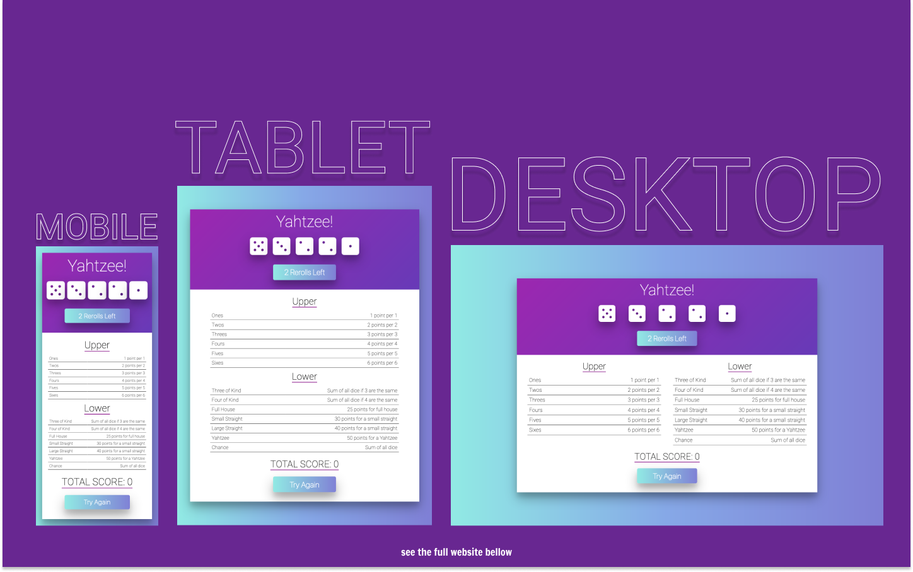

# Yahtzee Game Built with React

## Table of contents

- [Overview](#overview)
  - [Screenshot](#screenshot)
  - [Links](#links)
- [My process](#my-process)
  - [Built with](#built-with)
  - [What I learned](#what-i-learned)
- [Author](#author)

## Overview

### Screenshot

### Links

- Live Site URL: [https://kens-yahtzee-game.netlify.app/](https://kens-yahtzee-game.netlify.app/)

## My process

### Built with

- React
- Semantic HTML5 markup
- CSS Flexbox
- Mobile-first workflow

### What I learned

This was my first React project, which was a part of a course exercise. I've changed a couple of things from the original design. also I made it fully responsive. There were a lot of challenges for this project, on top of that since I wasn't really experinced those challenges doubled. However, I've learned a lot while building this project and I'm really happy how it turned out at the end. I've had a lot of fun both while building and while playing the app. I hope you like it too!

## Author

- Medium - [@kens_visuals](https://medium.com/@kens_visuals)
- CodePen - [@kens-visuals](https://codepen.io/kens-visuals)
- Codewars - [@kens_visuals](https://www.codewars.com/users/kens_visuals)
